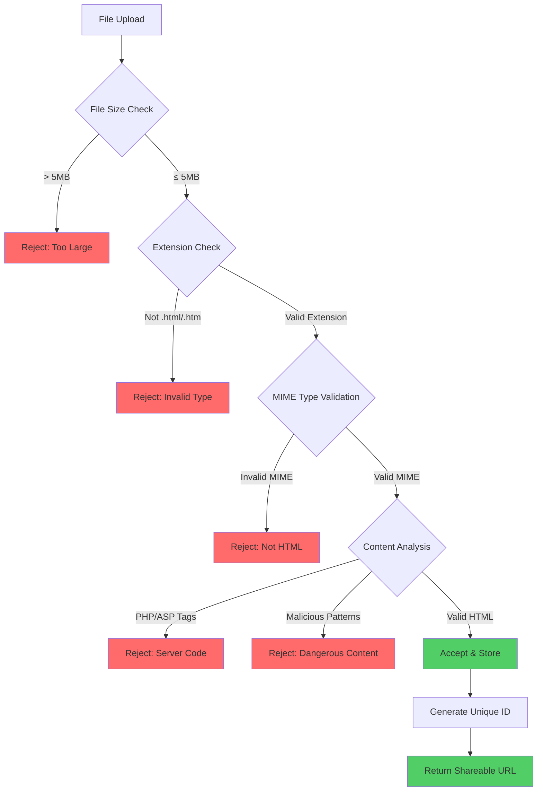
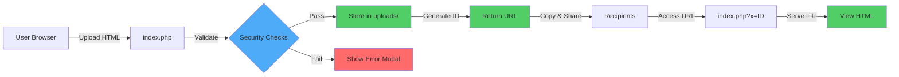
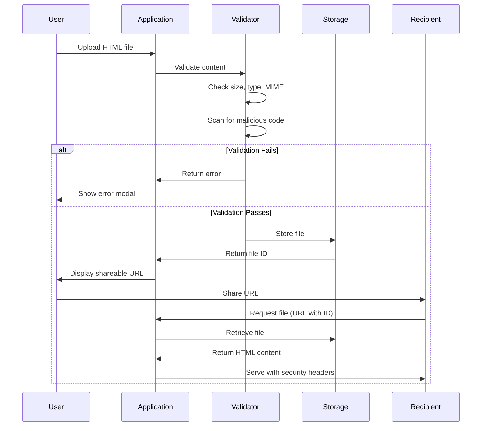

# xsukax HTML File Hosting

<div align="center">


**A secure, privacy-focused, and user-friendly HTML file hosting platform built with PHP**

[Features](#features) • [Installation](#installation) • [Usage](#usage) • [Security](#security-and-privacy) • [License](#license)

</div>

---

## 📋 Project Overview

**xsukax HTML File Hosting** is a lightweight, single-file PHP application that provides instant HTML file hosting with full CSS and JavaScript support. Designed with security and privacy as core principles, this platform enables users to upload, share, and host HTML files without requiring registration or authentication.

The application validates all uploaded content, generates unique shareable URLs, and serves files with appropriate security headers to prevent malicious code execution while preserving the original functionality and design of hosted HTML pages.

### Primary Purpose

- **Instant HTML Hosting**: Upload HTML files and receive shareable links immediately
- **Zero Barrier Entry**: No registration, authentication, or login required
- **Full Resource Support**: External CSS, JavaScript, fonts, and images work seamlessly
- **Privacy-First Architecture**: No user tracking, data collection, or personal information storage
- **Security-Hardened**: Multiple validation layers prevent malicious code execution

---

## 🔒 Security and Privacy Benefits

xsukax HTML File Hosting implements a comprehensive security architecture that protects both the server infrastructure and end users from potential threats while respecting user privacy.

### Content Validation Security



### Security Measures

| Security Feature | Implementation | Protection Against |
|------------------|----------------|---------------------|
| **MIME Type Validation** | Uses PHP's `finfo_open()` to verify actual file content beyond extensions | File type spoofing, malicious uploads |
| **Content Sanitization** | Scans for PHP tags (`<?php`), ASP tags (`<%`), and dangerous patterns | Server-side code injection, remote code execution |
| **Unique File Identifiers** | 16-byte cryptographically secure random IDs via `random_bytes()` | File enumeration, unauthorized access |
| **Security Headers** | `X-Frame-Options`, `X-Content-Type-Options`, `X-XSS-Protection`, CSP | Clickjacking, MIME sniffing, XSS attacks |
| **Directory Protection** | `.htaccess` rules block direct access to upload directory | Directory traversal, unauthorized file access |
| **File Permissions** | Strict `0644` permissions on uploaded files | Unauthorized modification, execution |
| **Content Security Policy** | Balanced CSP allows external resources while restricting inline execution | XSS, code injection, unauthorized resource loading |

### Privacy Protections

- **No User Tracking**: Zero analytics, cookies, or tracking mechanisms
- **No Data Collection**: No personal information, IP addresses, or metadata stored
- **No Authentication Required**: Complete anonymity for all users
- **No Session Storage**: Files are not associated with user identities
- **Transparent Operation**: Open-source code allows full security audit

### Upload Directory Isolation

The application creates a secured upload directory with multiple protection layers:

```
uploads/
├── .htaccess          # Blocks direct HTTP access
├── index.php          # Returns 403 Forbidden on directory access
└── [uploaded files]   # Accessible only via application logic
```

---

## ✨ Features and Advantages

### Core Features

- **🚀 Instant Upload**: Drag-and-drop or click-to-browse file upload interface
- **🔗 Unique URLs**: Cryptographically secure 16-character file identifiers
- **🎨 Full Formatting**: Preserves all CSS styling, JavaScript functionality, and external resources
- **📱 Responsive Design**: Mobile-friendly interface built with Tailwind CSS
- **🗑️ File Management**: Users can delete their uploaded files via confirmation dialog
- **📊 Live Statistics**: Real-time display of total hosted files and storage usage
- **⚡ Zero Configuration**: Single-file deployment with automatic directory initialization

### Advantages Over Alternatives

| Feature | xsukax | Pastebin-style Services | GitHub Pages | Traditional Hosting |
|---------|--------|-------------------------|--------------|---------------------|
| **No Registration** | ✅ | ⚠️ Limited | ❌ Requires account | ❌ Requires account |
| **Instant Deployment** | ✅ | ✅ | ⚠️ Delayed | ⚠️ Setup required |
| **External Resources** | ✅ Full support | ⚠️ Limited | ✅ | ✅ |
| **Privacy-First** | ✅ No tracking | ❌ Analytics | ⚠️ Public profiles | ⚠️ Varies |
| **File Management** | ✅ Delete anytime | ⚠️ Limited | ✅ | ✅ |
| **Self-Hosted** | ✅ | ❌ | ❌ | ✅ |
| **Cost** | 🆓 Free | 🆓/💰 Freemium | 🆓 Free | 💰 Paid |

### User Experience Features

- **Visual Feedback**: Real-time file information display before upload
- **Copy-to-Clipboard**: One-click URL copying with success notification
- **Error Handling**: Clear, descriptive error messages with actionable guidance
- **Loading States**: Visual indicators during upload process
- **Confirmation Dialogs**: Prevents accidental file deletion
- **Smooth Animations**: Professional fade-in and scale effects

---

## 🚀 Installation

### System Requirements

- **PHP**: Version 7.4 or higher (8.0+ recommended)
- **PHP Extensions**: 
  - `fileinfo` (for MIME type detection)
  - `mbstring` (for string handling)
- **Web Server**: Apache, Nginx, or compatible server
- **File Permissions**: Write access for upload directory creation
- **Storage**: Minimum 100MB recommended for initial deployment

### Installation Steps

#### 1. Download the Application

Clone the repository or download the latest release:

```bash
# Clone via Git
git clone https://github.com/xsukax/xsukax-HTML-File-Hosting.git
cd xsukax-HTML-File-Hosting

# Or download directly
wget https://github.com/xsukax/xsukax-HTML-File-Hosting/archive/refs/heads/main.zip
unzip main.zip
cd xsukax-HTML-File-Hosting-main
```

#### 2. Deploy to Web Server

**For Apache:**

```bash
# Copy to web root
sudo cp index.php /var/www/html/

# Or create a dedicated directory
sudo mkdir /var/www/html/htmlhost
sudo cp index.php /var/www/html/htmlhost/

# Set proper permissions
sudo chown www-data:www-data /var/www/html/htmlhost
sudo chmod 755 /var/www/html/htmlhost
```

**For Nginx:**

```bash
# Copy to web root
sudo cp index.php /usr/share/nginx/html/

# Set proper permissions
sudo chown nginx:nginx /usr/share/nginx/html/index.php
sudo chmod 644 /usr/share/nginx/html/index.php
```

#### 3. Configure PHP (Optional)

Adjust PHP settings for optimal performance:

```ini
# In php.ini or .user.ini
upload_max_filesize = 5M
post_max_size = 6M
max_execution_time = 30
memory_limit = 128M
file_uploads = On
```

#### 4. Verify Installation

Access the application in your browser:

```
http://your-domain.com/index.php
```

You should see the upload interface immediately. The `uploads/` directory will be created automatically on first access.

#### 5. Security Hardening (Recommended)

**Enable HTTPS:**

```bash
# Install Certbot for Let's Encrypt
sudo apt install certbot python3-certbot-apache  # For Apache
sudo apt install certbot python3-certbot-nginx   # For Nginx

# Obtain certificate
sudo certbot --apache -d your-domain.com        # For Apache
sudo certbot --nginx -d your-domain.com         # For Nginx
```

**Configure Firewall:**

```bash
# Allow HTTP and HTTPS only
sudo ufw allow 'Apache Full'    # For Apache
sudo ufw allow 'Nginx Full'     # For Nginx
sudo ufw enable
```

---

## 📖 Usage Guide

### Application Architecture



### Basic Workflow

#### Step 1: Upload an HTML File

**Method A: Drag and Drop**

1. Open the application in your browser
2. Drag your HTML file into the upload zone
3. The file information will display automatically
4. Click the **"Upload"** button

**Method B: File Browser**

1. Click the **"Choose File"** button
2. Select your HTML file from the file picker
3. Review the file details
4. Click the **"Upload"** button

#### Step 2: Share Your File

After successful upload, you'll receive:

- **Shareable URL**: `https://your-domain.com/index.php?x=abc123def456`
- **File Details**: Original filename, file size, unique identifier
- **Action Buttons**: View the file or delete it

**Copy the URL:**

1. Click the **"Copy"** button next to the URL field
2. A success notification confirms the copy action
3. Share the URL via email, messaging, or social media

#### Step 3: View Hosted File

Recipients can access the file by:

1. Opening the shared URL in any browser
2. The HTML file renders with all CSS and JavaScript intact
3. External resources (CDN libraries, fonts, images) load normally

#### Step 4: Delete File (Optional)

To remove a hosted file:

1. Use the URL provided after upload
2. Click the **"Delete File"** button
3. Confirm deletion in the modal dialog
4. The file is permanently removed

### File Access Patterns



### Advanced Usage

#### Monitoring Storage

The header displays real-time statistics:

- **Files Hosted**: Total number of HTML files stored
- **Storage Used**: Aggregate size of all uploaded files

#### Customizing Upload Limits

Edit the configuration constants in `index.php`:

```php
// Modify these values as needed
define('MAX_FILE_SIZE', 10 * 1024 * 1024); // Change to 10MB
define('ALLOWED_EXTENSIONS', ['html', 'htm', 'xhtml']); // Add .xhtml
```

#### Setting Up Cron for Cleanup (Optional)

Create a cleanup script to remove old files:

```bash
#!/bin/bash
# cleanup.sh - Remove files older than 30 days
find /var/www/html/htmlhost/uploads -name "*.html" -mtime +30 -delete
```

Add to crontab:

```bash
# Run daily at 2 AM
0 2 * * * /path/to/cleanup.sh
```

---

## 🔧 Configuration

### Environment Variables

While the application works out-of-the-box, you can customize behavior by editing constants:

```php
// Maximum file size (bytes)
define('MAX_FILE_SIZE', 5 * 1024 * 1024);

// Allowed file extensions
define('ALLOWED_EXTENSIONS', ['html', 'htm']);

// Allowed MIME types for validation
define('ALLOWED_MIME_TYPES', ['text/html', 'text/plain', 'application/octet-stream']);

// Upload directory name
define('UPLOAD_DIR', 'uploads');
```

### Web Server Configuration

**Apache (.htaccess in application directory):**

```apache
# Prevent PHP execution in uploads directory
<Directory "uploads">
    php_flag engine off
    Options -Indexes
    Order deny,allow
    Deny from all
</Directory>

# Enable mod_rewrite for clean URLs (optional)
RewriteEngine On
RewriteCond %{REQUEST_FILENAME} !-f
RewriteRule ^([a-f0-9]{16})$ index.php?x=$1 [L,QSA]
```

**Nginx (add to server block):**

```nginx
# Block access to uploads directory
location /uploads/ {
    deny all;
    return 403;
}

# Optional: Clean URLs
location ~ ^/([a-f0-9]{16})$ {
    try_files $uri /index.php?x=$1;
}
```

---

## 🛠️ Troubleshooting

### Common Issues

| Issue | Cause | Solution |
|-------|-------|----------|
| **Upload fails silently** | PHP `upload_max_filesize` too low | Increase in `php.ini` to at least 5M |
| **Permission denied error** | Web server cannot create `uploads/` | Run `chmod 755` on application directory |
| **File not found (404)** | Incorrect URL or file deleted | Verify URL contains correct 16-character ID |
| **MIME validation fails** | `fileinfo` extension disabled | Enable in `php.ini`: `extension=fileinfo` |
| **Cannot delete files** | File permissions too restrictive | Ensure files have `644` permissions |

### Debug Mode

Enable error display for troubleshooting:

```php
// Temporarily add at top of index.php
error_reporting(E_ALL);
ini_set('display_errors', 1);
```

**Remember to disable before production use.**

---

## 🤝 Contributing

Contributions are welcome! Please follow these guidelines:

1. **Fork** the repository
2. **Create** a feature branch (`git checkout -b feature/amazing-feature`)
3. **Commit** your changes (`git commit -m 'Add amazing feature'`)
4. **Push** to the branch (`git push origin feature/amazing-feature`)
5. **Open** a Pull Request

### Code Standards

- Follow PSR-12 coding standards for PHP
- Maintain existing security validation patterns
- Add comments for complex logic
- Test thoroughly before submitting

---

## 📝 License

This project is licensed under the GNU General Public License v3.0.

---

## 🔗 Links

- **Repository**: [https://github.com/xsukax/xsukax-HTML-File-Hosting](https://github.com/xsukax/xsukax-HTML-File-Hosting)
- **Issues**: [Report a bug or request a feature](https://github.com/xsukax/xsukax-HTML-File-Hosting/issues)
- **License**: [GNU GPL v3.0](https://www.gnu.org/licenses/gpl-3.0.en.html)

---

## 📞 Support

For questions, issues, or suggestions:

- Open an issue on GitHub
- Check existing issues for solutions
- Review the troubleshooting section above

---

<div align="center">

**Made with ❤️ by the xsukax**

⭐ Star this repository if you find it useful!

</div>
